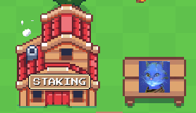

# 🎮 How to play?

### Get a Pet 🐈

Before you start to farm you should mint an animal:\
1\. Move around in the game by using "W", "S", "D", "A". You can also hold mouse/finger on-screen and move around.\
2\. Choose your animal and start to earn catcoins or catshares.\
\
🙌 Congratulations! You have just minted your very own 8BitCat NFT.\
\
3\. Stake your animal.\
4\. Stake your catcoins in farms and your catshares in boardroom.\
\
